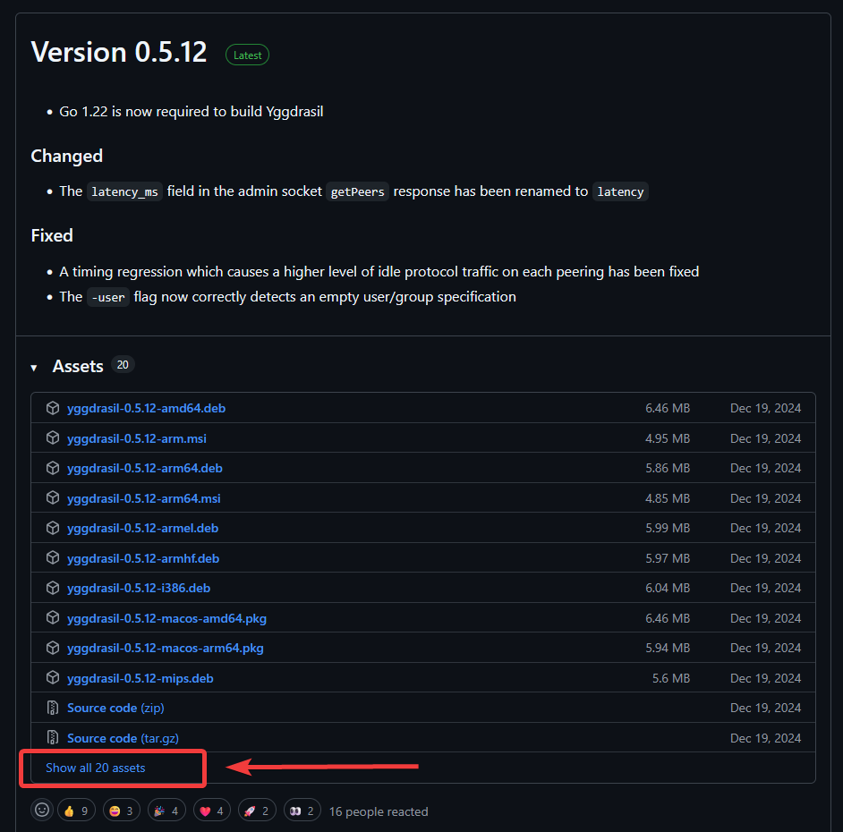
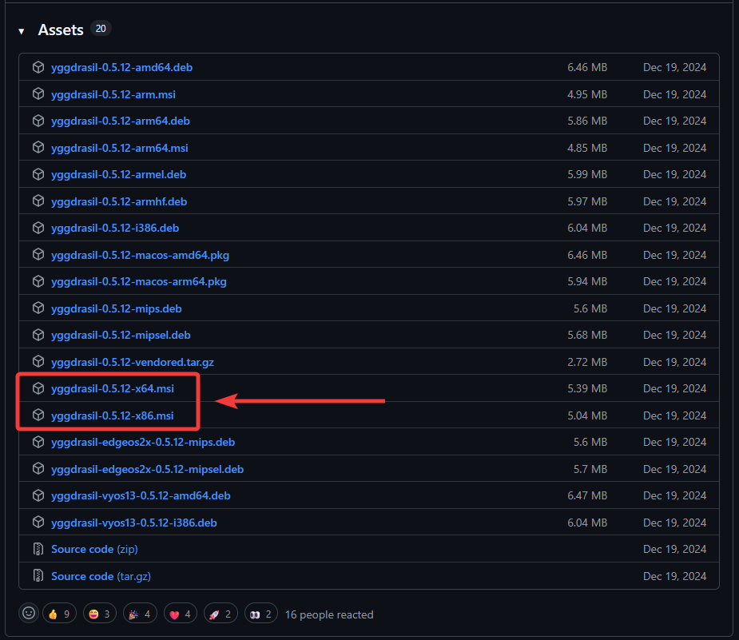
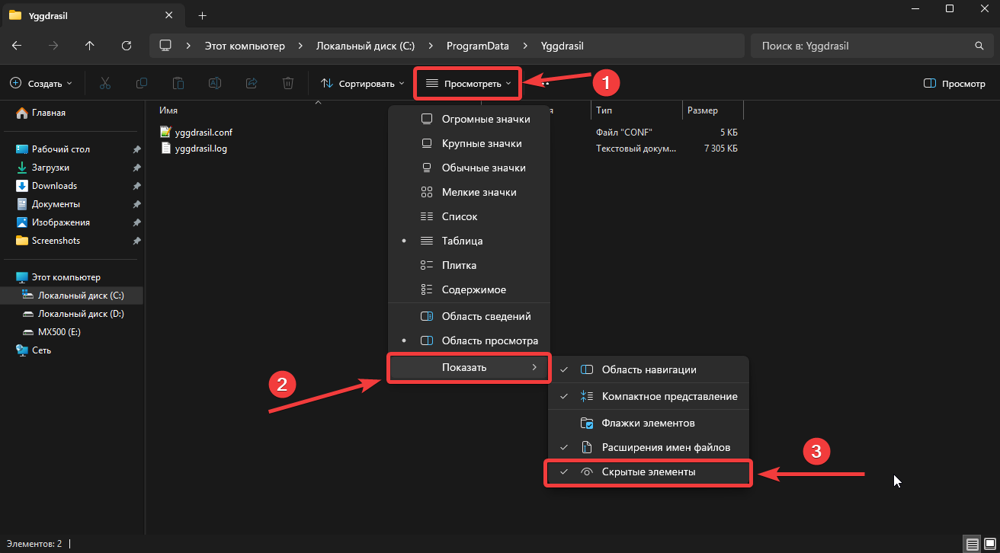

# Введение
Это руководство по настройке сети [Yggdrasil](https://github.com/yggdrasil-network/yggdrasil-go) на Windows.
 У моих друзей при установке и настройке Yggdrasil появлялись различные трудности, поэтому я решил написать это руководство.
 Здесь не будет какого-либо углублённого изучения или чего-либо в этом духе, поскольку я сам не очень хорошо знаю, как работает Yggdrasil. Только установка и настройка для обычного пользователя.

# Установка
Перейдите [сюда](https://github.com/yggdrasil-network/yggdrasil-go/releases) (раздел Releases проекта Yggdrasil). Перед вами откроется самый новый релиз.
 Прокрутите страницу до "Assets" и внизу нажмите "Show all assets", как на картинке: 

 (версии могут отличаться от тех, что на скриншоте, это нормально) 
 Список станет больше.
 После этого найдите сборки для Windows.
 На картинке ниже нужные варианты выделены красным:

 Теперь нужно понять, какую сборку скачивать.
 
 Если у вас 64-разрядное устройство, то выбирайте сборку, у которой перед ".msi" написано "x64".
 Если у вас 32-разрядное устройство, то выбирайте сборку, у которой перед ".msi" написано "x86".
 Если вы не знаете, какое у вас устройство, то попробуйте x64, на этой архитектуре работают почти все современные компьютеры.
 Но если приложение не запустится, попробуйте x86.
 (ARM не описывается, так как это инструкция для обычных пользователей, имеющих массовое домашнее железо)
 
 При нажатии по синему названию сборки, у вас начнётся скачивание файла.
 Запустите скачанный файл.
 После установки создаётся сетевой адаптер, служба Yggdrasil и некоторые файлы.
 Yggdrasil ЕЩЁ НЕ РАБОТАЕТ!
# Настройка
Для работы необходимо отредактировать конфиг (добавить в него пиры).
 Пиры можно найти на [этой странице](https://github.com/yggdrasil-network/public-peers)
 Выберите Ваш континент и откройте файл с названием Вашей страны.
 (вот [ссылка](https://github.com/yggdrasil-network/public-peers/blob/master/europe/russia.md) для России)
 Конфиг располагается по следующему пути: C:\ProgramData\Yggdrasil\yggdrasil.conf
 Папка ProgramData может быть скрыта по умолчанию, можете включить отображение скрытых элементов: Просмотреть > Показать > Скрытые элементы (для Windows 11).
 Так это выглядит в Windows 11:

 Теперь отредактируем конфиг.
